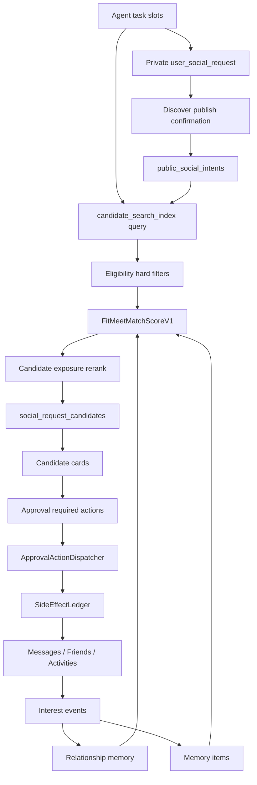

# FitMeet Social Core v1 Design

Last updated: 2026-06-27

This document turns the current Agent, Discover, Candidate Pool, Messages,
Approval, and Memory modules into a stable Social Core v1. It is a design and
implementation boundary, not a rewrite plan.

## Goal

FitMeet should behave like a controlled social execution system:

```text
user states a meet-up or friend-making need
-> Agent extracts task slots
-> deterministic services create a card or search query
-> user confirms high-risk actions
-> Discover, matching, messaging, friends, and meet-loop services execute
-> behavior and relationship memory improve the next recommendation
```

The model may classify, extract, explain, and write copy. It must not decide
whether a side effect happened or bypass approvals.

## Non-Goals

- Do not replace the existing Agent runtime.
- Do not move to a new vector database as part of v1.
- Do not let LLMs recall, rank, publish, message, or connect candidates.
- Do not expose internal worker, trace, planner, ledger, or debug concepts to
  normal users.
- Do not implement all systems in one PR.

## Current Assets

Existing modules already cover most product surfaces:

- `/agent`, `/agent/chat/:taskId`, `/agent/profile`
- `/discover`, `/public-intent/:id`
- `/messages`
- `AgentGatewayModule`
- `MessagesModule`
- `FriendsModule`
- `SocialRequestsModule`
- `MatchModule`
- `MeetsModule`
- `ActivitiesModule`
- `SafetyModule`
- `AgentApprovalRequest`
- `AgentSideEffectLedgerService`
- `SocialAgentCandidatePoolService`
- `SocialAgentUserInterestEventService`
- `SocialAgentLongTermMemoryService`

Social Core v1 adds structure around four systems:

1. Candidate search index
2. Match scoring and ranking
3. Item and relationship memory
4. Unified approval dispatch

## System Diagram



## Core Invariants

- Candidate supply must come from real public or explicitly authorized sources.
- Profile, public intent, activity, block, safety, and contact boundaries are
  enforced before a candidate reaches the model.
- Matching is database filtering plus deterministic scoring. LLMs only explain
  ranked results and generate opener copy.
- Publishing to Discover, sending messages, connecting candidates, creating
  activities, contact exchange, precise location reveal, and sensitive profile
  writes require approval.
- Approved side effects must run through the side-effect ledger with stable
  idempotency keys.
- Memory writeback must be explainable, deletable, and scoped by sensitivity.

## 1. Candidate Search Index

### Problem

The current candidate pool can load profiles, delegates, public intents,
legacy requests, blocked ids, life graph signals, and behavior summaries in
application code. That works at small scale, but it creates three production
risks:

- search can drift toward full scans;
- authorization checks are repeated in many places;
- newly updated profiles and public intents are not represented by one stable
  searchable projection.

### Table

Add an incremental migration for `candidate_search_index`.

```sql
CREATE TABLE candidate_search_index (
  id SERIAL PRIMARY KEY,
  source_type varchar(40) NOT NULL,
  source_id varchar(120) NOT NULL,
  user_id integer NOT NULL,

  is_real_user boolean NOT NULL DEFAULT true,
  profile_discoverable boolean NOT NULL DEFAULT false,
  agent_can_recommend_me boolean NOT NULL DEFAULT false,
  agent_can_start_chat_after_approval boolean NOT NULL DEFAULT false,

  status varchar(32) NOT NULL DEFAULT 'active',

  city varchar(100) NOT NULL DEFAULT '',
  area_text varchar(160) NOT NULL DEFAULT '',
  geohash varchar(32) NOT NULL DEFAULT '',
  lat double precision,
  lng double precision,
  radius_km integer NOT NULL DEFAULT 5,

  activity_types jsonb NOT NULL DEFAULT '[]'::jsonb,
  interest_tags jsonb NOT NULL DEFAULT '[]'::jsonb,
  lifestyle_tags jsonb NOT NULL DEFAULT '[]'::jsonb,
  social_scenes jsonb NOT NULL DEFAULT '[]'::jsonb,
  relationship_goals jsonb NOT NULL DEFAULT '[]'::jsonb,
  time_buckets jsonb NOT NULL DEFAULT '[]'::jsonb,

  public_summary text NOT NULL DEFAULT '',
  public_safety_notes jsonb NOT NULL DEFAULT '[]'::jsonb,

  safety_flags jsonb NOT NULL DEFAULT '[]'::jsonb,
  trust_score integer NOT NULL DEFAULT 0,
  profile_completeness integer NOT NULL DEFAULT 0,

  exposure_count integer NOT NULL DEFAULT 0,
  last_recommended_at timestamptz,
  last_active_at timestamptz,

  source_updated_at timestamptz,
  created_at timestamptz NOT NULL DEFAULT now(),
  updated_at timestamptz NOT NULL DEFAULT now(),

  UNIQUE (source_type, source_id)
);

CREATE INDEX idx_candidate_search_index_active_city
ON candidate_search_index (status, city, user_id);

CREATE INDEX idx_candidate_search_index_profile_optin
ON candidate_search_index (
  profile_discoverable,
  agent_can_recommend_me,
  status
);

CREATE INDEX idx_candidate_search_index_updated
ON candidate_search_index (source_updated_at, updated_at);
```

### Sources

| source_type | Source table | v1 condition |
| --- | --- | --- |
| `profile` | `user_social_profiles` | `profileDiscoverable=true` or `agentCanRecommendMe=true` |
| `public_intent` | `public_social_intents` | public, active/searching, not expired/tombstoned |
| `activity` | activities/signups | P1, only public and joinable |

The index must never store phone numbers, WeChat ids, exact addresses,
unconsented precise coordinates, or unconfirmed sensitive tags.

### Services

Add:

```text
backend/src/agent-gateway/entities/candidate-search-index.entity.ts
backend/src/agent-gateway/candidate-search-index.service.ts
backend/src/agent-gateway/candidate-eligibility.service.ts
backend/src/agent-gateway/candidate-exposure.service.ts
```

Initial service contract:

```ts
type CandidateSearchSourceType = 'profile' | 'public_intent' | 'activity';

type CandidateSearchQuery = {
  ownerUserId: number;
  socialRequestId?: number | null;
  publicIntentId?: string | null;
  city?: string | null;
  activityTypes?: string[];
  interestTags?: string[];
  timeBuckets?: string[];
  limit?: number;
};

class CandidateSearchIndexService {
  upsertFromSocialProfile(userId: number): Promise<void>;
  upsertFromPublicIntent(publicIntentId: string): Promise<void>;
  removePublicIntent(publicIntentId: string): Promise<void>;
  markUserPaused(userId: number): Promise<void>;
  markUserBlocked(userId: number): Promise<void>;
  search(input: CandidateSearchQuery): Promise<CandidateSearchIndex[]>;
}
```

### Update Triggers

Index updates must be deterministic and not LLM driven:

- profile save or privacy setting change;
- matching authorization change;
- Discover publish/read-back success;
- Discover tombstone/dismiss;
- public intent expiry or close;
- block, report, ban, or safety restriction;
- activity publish/cancel/end in P1.

## 2. Matching Engine

### Flow

```text
task slots / social request / public intent
-> candidate_search_index recall, max 200
-> eligibility hard filters
-> FitMeetMatchScoreV1
-> exposure and feedback rerank
-> persist top 20 candidate rows
-> show top 3 candidate cards
```

### Hard Filters

Hard filters must happen before LLM explanation:

```ts
eligible =
  candidate.isRealUser &&
  candidate.userId !== ownerUserId &&
  candidate.status === 'active' &&
  notBlocked(candidate.userId) &&
  notSafetyExcluded(candidate.userId) &&
  onboardingReady(candidate.userId) &&
  (
    candidate.profileDiscoverable ||
    candidate.agentCanRecommendMe ||
    candidate.sourceType === 'public_intent' ||
    candidate.sourceType === 'activity'
  ) &&
  cityMatches(query, candidate);
```

### Score

Define `FitMeetMatchScoreV1`.

```text
matchScore =
  0.18 * distanceScore
+ 0.16 * timeOverlapScore
+ 0.18 * interestSimilarityScore
+ 0.10 * relationshipGoalScore
+ 0.10 * socialBoundaryFitScore
+ 0.08 * trustworthinessScore
+ 0.08 * behaviorFeedbackScore
+ 0.05 * freshnessScore
+ 0.04 * reciprocityScore
+ 0.03 * diversityScore
- safetyPenalty
- rejectionPenalty
- overExposurePenalty
```

Use existing score breakdown fields where possible:

- `distance`
- `timeOverlap`
- `interestSimilarity`
- `relationshipGoal`
- `socialBoundaryFit`
- `boundaryFit`
- `trustworthiness`
- `safetyRisk`

Add feedback from `SocialAgentUserInterestEventService.summarizeForUser()`:

- `skip_candidate` lowers similar candidates;
- `save_candidate` raises similar candidates;
- `send_invite`, `invite_accepted`, `connect_candidate`, `activity_complete`,
  and `review_positive` raise similar candidates;
- `review_negative` lowers similar candidates;
- repeated exposure lowers rank unless there is fresh reciprocal signal.

### Candidate Row Extension

Add an incremental migration for `social_request_candidates` metadata:

```sql
ALTER TABLE social_request_candidates
ADD COLUMN source_type varchar(40) NOT NULL DEFAULT 'profile',
ADD COLUMN source_id varchar(120) NOT NULL DEFAULT '',
ADD COLUMN public_intent_id varchar(80),
ADD COLUMN activity_id integer,
ADD COLUMN rank_position integer,
ADD COLUMN score_version varchar(40) NOT NULL DEFAULT 'fitmeet_match_v1',
ADD COLUMN explanation jsonb NOT NULL DEFAULT '{}'::jsonb,
ADD COLUMN relationship_state jsonb NOT NULL DEFAULT '{}'::jsonb,
ADD COLUMN exposure_reason varchar(120) NOT NULL DEFAULT '',
ADD COLUMN user_action varchar(40) NOT NULL DEFAULT '',
ADD COLUMN user_action_at timestamptz;
```

This lets admin and future evaluation answer:

- why this person was recommended;
- which source generated the candidate;
- whether the user viewed, saved, skipped, invited, or connected;
- whether the candidate is over-exposed;
- which score version produced the rank.

### Service Split

P0 can keep most code inside `SocialAgentCandidatePoolService`, but it should
use new internal seams:

```text
CandidateSearchIndexService
CandidateEligibilityService
CandidateExposureService
SocialAgentCandidateScoring
```

Target orchestration:

```ts
const recalled = await candidateIndex.search(query);
const eligible = await eligibility.filter(recalled, query);
const scored = eligible.map((candidate) =>
  scoring.score({
    candidate,
    query,
    userInterestSummary,
    lifeGraphSignals,
    relationshipMemory,
  }),
);
const ranked = exposure.rerank(scored);
await persistCandidateRows(query.socialRequestId, ranked.slice(0, 20));
return ranked.slice(0, displayLimit);
```

## 3. Memory System

### Problem

Current task memory and long-term memory are useful, but v1 needs:

- item-level memory with source and sensitivity;
- relationship memory per user pair;
- feedback writeback from candidate actions;
- top-k retrieval instead of dumping a full profile/memory object into LLM
  context.

### Schema Drift Check

Before adding new memory tables, verify the current
`SocialAgentLongTermMemory` entity and production schema. The baseline history
has used both of these shapes:

```text
userId / preferences / boundaries / activityPreferences / matchSignals
ownerUserId / preferenceMemory / safetyMemory / relationshipMemory / activityMemory
```

P0 must add a schema test that asserts entity columns match the current
incremental migrations. If production uses the old shape, add a compatibility
migration instead of editing an executed baseline migration.

### `social_agent_memory_items`

```sql
CREATE TABLE social_agent_memory_items (
  id SERIAL PRIMARY KEY,
  user_id integer NOT NULL REFERENCES users(id) ON DELETE CASCADE,

  memory_type varchar(40) NOT NULL,
  memory_key varchar(120) NOT NULL,
  memory_value text NOT NULL,

  confidence double precision NOT NULL DEFAULT 0.8,
  status varchar(32) NOT NULL DEFAULT 'confirmed',
  visibility varchar(32) NOT NULL DEFAULT 'private',
  sensitive_level varchar(32) NOT NULL DEFAULT 'low',

  source_type varchar(40) NOT NULL DEFAULT 'agent_task',
  source_task_id integer,
  source_message_id varchar(160),
  source_event_id integer,

  expires_at timestamptz,
  created_at timestamptz NOT NULL DEFAULT now(),
  updated_at timestamptz NOT NULL DEFAULT now()
);

CREATE INDEX idx_memory_items_user_type_status
ON social_agent_memory_items (user_id, memory_type, status);

CREATE INDEX idx_memory_items_user_key
ON social_agent_memory_items (user_id, memory_key);
```

Allowed memory types:

```text
preference
boundary
availability
interest
social_style
candidate_preference
feedback
safety
profile_fact
```

### `social_agent_relationship_memory`

```sql
CREATE TABLE social_agent_relationship_memory (
  id SERIAL PRIMARY KEY,
  user_id integer NOT NULL REFERENCES users(id) ON DELETE CASCADE,
  target_user_id integer NOT NULL REFERENCES users(id) ON DELETE CASCADE,

  relationship_state varchar(40) NOT NULL DEFAULT 'none',
  last_candidate_record_id integer,
  last_social_request_id integer,
  last_conversation_id varchar(120),

  positive_score double precision NOT NULL DEFAULT 0,
  negative_score double precision NOT NULL DEFAULT 0,

  last_action varchar(80) NOT NULL DEFAULT '',
  last_action_at timestamptz,

  notes jsonb NOT NULL DEFAULT '{}'::jsonb,
  created_at timestamptz NOT NULL DEFAULT now(),
  updated_at timestamptz NOT NULL DEFAULT now(),

  UNIQUE (user_id, target_user_id)
);
```

Initial relationship states:

```text
recommended
viewed
saved
skipped
invited
awaiting_reply
chatting
connected
met
blocked
rejected
```

### Services

Add:

```text
SocialAgentMemoryItemService
SocialAgentMemoryRetrievalService
SocialAgentRelationshipMemoryService
SocialAgentMemoryWritebackService
```

Retrieval should return a bounded context pack:

```text
max 3 activity preferences
max 2 time/location preferences
max 2 safety boundaries
max 3 candidate feedback memories
max 3 relationship memories
```

### Writeback Rules

| Source | Memory action |
| --- | --- |
| explicit user statement | confirmed memory item |
| candidate save | interest event + relationship state `saved` |
| candidate skip | interest event + relationship state `skipped` |
| opener send | interest event + relationship state `invited` or `awaiting_reply` |
| message reply | relationship state `chatting` |
| friend connect | relationship state `connected` |
| meet completed | relationship state `met` + positive or negative memory |
| Agent inference | proposed memory item, user confirmation required when private/sensitive |

## 4. Unified Approval Dispatch

### Problem

Approvals exist, but high-risk action execution should be centralized so no
Agent path can bypass approval and ledger guarantees.

### Dispatcher

Add:

```text
backend/src/agent-gateway/social-agent-approval-action-dispatcher.service.ts
backend/src/agent-gateway/social-agent-approval-policy.matrix.ts
```

Contract:

```ts
class SocialAgentApprovalActionDispatcher {
  dispatch(approval: AgentApprovalRequest): Promise<unknown> {
    switch (approval.actionType) {
      case 'send_message':
      case 'send_invite':
        return this.dispatchSendMessage(approval);
      case 'add_friend':
      case 'connect_candidate':
        return this.dispatchConnectCandidate(approval);
      case 'publish_social_request':
      case 'publish_to_discover':
        return this.dispatchPublishToDiscover(approval);
      case 'create_activity':
        return this.dispatchCreateActivity(approval);
      case 'contact_exchange':
        return this.dispatchContactExchange(approval);
      case 'share_location':
        return this.dispatchShareLocation(approval);
      default:
        throw new Error(`unsupported_approval_action:${approval.actionType}`);
    }
  }
}
```

All dispatcher methods must:

- require an approved approval id;
- derive or validate a stable idempotency key;
- claim the side-effect ledger row;
- execute deterministic service code;
- write public-safe event/audit output;
- return the same completed result for duplicate confirmation.

### Approval Matrix

| Action | Risk | Approval | Executor |
| --- | --- | --- | --- |
| view candidate | low | no | interest event |
| save candidate | low | no | interest event |
| skip candidate | low | no | interest event |
| more like this | low | no | candidate search |
| generate opener | low | no | draft only |
| publish Discover card | medium | yes | approval + public intent |
| send first message | medium | yes | approval + messages |
| connect candidate | medium | yes | approval + contact policy |
| create offline activity | medium | yes | approval + activity |
| submit meet proof | medium | yes/configurable | approval + upload |
| reveal precise location | high | yes + stronger warning | approval + redaction |
| exchange contact | high | yes + stronger warning | approval + contact exchange |
| night/private venue meeting | high | safety review | approval or block |
| payment | high | payment approval | payment service |

### Approval Payload

User-facing approval cards must render from a deterministic preview, not raw
LLM text:

```json
{
  "schemaVersion": "fitmeet.approval.v1",
  "actionType": "send_invite",
  "taskId": 123,
  "targetUserId": 456,
  "candidateRecordId": 789,
  "visibleContent": {
    "message": "嗨，我也在找周末羽毛球搭子，方便先站内聊聊时间吗？"
  },
  "riskLevel": "medium",
  "riskReasons": [
    "这个动作会联系真实用户",
    "发送前必须由你确认",
    "不会自动交换联系方式或精确位置"
  ],
  "sideEffectBeforeApproval": "none",
  "idempotencyKey": "opener-send:123:456"
}
```

## Frontend Card Contract

The frontend should only expose four user-facing card families.

### Candidate Card

```text
候选人：小林
匹配度：82
理由：
- 也喜欢羽毛球
- 周末下午有空
- 同城，位置已模糊
安全：
- 首次建议公共场所
- 发送前需要确认
按钮：
查看详情 / 生成开场白 / 先收藏 / 发送邀请 / 不感兴趣
```

### Opener Draft Card

```text
我写了一条低压力开场白：

“嗨，我也在找周末羽毛球搭子，看到你也是中等水平，方便先站内聊聊时间吗？”

按钮：
确认发送 / 重写 / 取消
```

### Approval Card

```text
这个动作会联系真实用户。
确认前我不会发送消息、加好友或公开联系方式。

将发送给：小林
内容：...
风险等级：中
边界：
- 不交换微信/手机号
- 不公开精确位置
- 可撤回/可拉黑/可举报

按钮：
确认执行 / 修改 / 取消
```

### Memory Confirmation Card

```text
我发现一个可能有用的偏好：

“你更喜欢周末下午、同城、低压力的羽毛球约练。”

是否记住？
按钮：
记住 / 不记 / 修改
```

## Implementation Order

### PR 1: Design and Schema Audit

- Add this design document.
- Add/extend schema drift tests for `SocialAgentLongTermMemory`.
- No production behavior change.

### PR 2: Candidate Search Index

- Add `candidate_search_index` entity and incremental migration.
- Build profile and public-intent upsert paths.
- Add backfill script for staging.
- Keep current candidate pool logic as fallback.

### PR 3: Candidate Pool Uses Index Recall

- Route candidate recall through `CandidateSearchIndexService`.
- Preserve existing scoring and candidate row output.
- Add hard-filter tests for self, blocked, private, hidden, expired, and
  tombstoned sources.

### PR 4: FitMeetMatchScoreV1 and Feedback Rerank

- Add score version.
- Add behavior feedback, rejection, freshness, reciprocity, diversity, and
  over-exposure adjustments.
- Persist score metadata to `social_request_candidates`.

### PR 5: Relationship Memory v1

- Add `social_agent_relationship_memory`.
- Write relationship state on view/save/skip/invite/message/connect.
- Feed relationship state into ranking.

### PR 6: Memory Items v1

- Add `social_agent_memory_items`.
- Write confirmed explicit memories and behavior feedback.
- Add bounded retrieval for Agent context.
- Do not expose raw memory internals to user pages.

### PR 7: Unified Approval Dispatcher

- Add `SocialAgentApprovalActionDispatcher`.
- Move publish/message/connect/create-activity approval execution through it.
- Enforce ledger idempotency in every dispatcher path.

### PR 8: Frontend Card Alignment

- Render candidate, opener, approval, and memory-confirmation cards from the
  deterministic contracts.
- Do not show raw JSON, trace ids, worker names, ledger ids, or internal terms.

## Verification Plan

### Backend

```bash
pnpm --dir backend lint
pnpm --dir backend build
pnpm --dir backend test --runInBand --detectOpenHandles
```

Targeted specs to add or extend:

```text
candidate-search-index.service.spec.ts
social-agent-candidate-pool.service.spec.ts
social-agent-candidate-scoring.spec.ts
social-agent-relationship-memory.service.spec.ts
social-agent-memory-item.service.spec.ts
social-agent-approval-action-dispatcher.service.spec.ts
```

### Database

- fresh database migration test;
- previous production schema upgrade test;
- index backfill dry-run;
- tombstone and privacy revocation consistency test.

### E2E

Use two or more real users in isolated staging:

```text
profile completion
-> matching authorization
-> publish OpportunityCard
-> Discover list/detail read-back
-> matching job
-> candidate cards
-> opener draft
-> approval confirmation
-> message conversation
-> relationship memory writeback
-> next matching query changes ranking
```

Failure branches:

```text
private profile not recommended
tombstoned public intent not recalled
blocked user not recalled
skip candidate lowers future rank
duplicate approval does not double-send
approval rejection prevents side effect
contact info hidden inside message is blocked
```

## Go / No-Go

Design PR:

- Go if docs and schema audit tests pass.

Candidate index PR:

- No-Go until fresh and upgrade migrations pass.
- No-Go if private or tombstoned sources can enter the index.

Matching PR:

- No-Go if LLM can influence recall or primary rank.
- No-Go if candidate rows lack score version and source metadata.

Approval dispatcher PR:

- No-Go if any Agent side-effect path can execute without approval and ledger.

Production:

- No-Go until staging proves the full Social Core loop with real users,
  real database, real messages, and failure injection.
